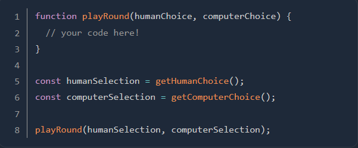

# rock-paper-scissors

<h1>Assignment from <a href="https://www.theodinproject.com/lessons/foundations-rock-paper-scissors">The Odin Project</a></h1>
<em>Remember to commit early and often! To refresh your memory, check out the commit messages lesson.</em>

<ol>
<li>
<h3>Setup the project structure</h3>
<ol>
<li>
Create a new Git repository for your project.
</li>
<li>
Create a blank HTML document with a script tag.
</li>
<li>
Check if the webpage includes JavaScript:
<ul>
<li>
Write <strong>console.log("Hello World")</strong> in JavaScript.
</li>
<li>
Check if “Hello World” is logged in the browser console once you open your webpage.
</li>
</ul>
</ol>
 
</li>
It’s best practice to link to an external JavaScript file inside this script tag. Using an external JavaScript file keeps your HTML file clean and organized.

 
You don’t have to write additional code in the HTML file. This game is played entirely via the console.
</li>

<li>
<h3>Write the logic to get the computer choice</h3>
Your game will be played against the computer. You will write a function that randomly returns “rock”, “paper” or “scissors”.

 
<ol>
<li>
Create a new function named <strong>getComputerChoice</strong>.
</li>
<li>
Write the code so that <strong>getComputerChoice</strong> will randomly return one of the following string values: “rock”, “paper” or “scissors”.
</li>
<ul>
<li>
Hint: The <a href="https://developer.mozilla.org/en-US/docs/Web/JavaScript/Reference/Global_Objects/Math/random">Math.random</a> method returns a random number that’s greater than or equal to 0 and less than 1. Think about how you can use this to conditionally return one of the multiple choices.
</li>
</ul>
<li>
Test that your function returns what you expect using <strong>console.log</strong> or the browser developer tools before advancing to the next step.
</li>
</ol>

<li>
<h3>Write the logic to get the human choice</h3>
Your game will be played by a human player. You will write a function that takes the user choice and returns it.

 
<ol>
<li>
Create a new function named <strong>getHumanChoice</strong>.
</li>
<li>
Write the code so that <strong>getHumanChoice</strong> will return one of the valid choices depending on what the user inputs.
</li>
<ul>
<li>
<strong>Hint:</strong> Use the <a href="https://developer.mozilla.org/en-US/docs/Web/API/Window/prompt">prompt</a> method to get the user’s input.
</li>
</ul>
<li>
Test what your function returns by using console.log.
</li>
</ol>
</li>

<li>
<h3>Declare the players score variables</h3>
Your game will keep track of the players score. You will write variables to keep track of the players score.
<ol>
<li>Create two new variables named <strong>humanScore</strong> and <strong>computerScore</strong> in the global scope.</li>
<li>Initialize those variables with the value of 0.</li>
</ol>
</li>

<li>
<h3>Write the logic to play a single round</h3>
Your game will be played round by round. You will write a function that takes the human and computer player choices as arguments, plays a single round, increments the round winner’s score and logs a winner announcement.

 
<ol>
<li>
Create a new function named <strong>playRound</strong>.
</li>
<li>
Define two parameters for <strong>playRound</strong>: <strong>humanChoice</strong> and <strong>computerChoice</strong>. Use these two parameters to take the human and computer choices as arguments.
</li>
<li>
Make your function’s <strong>humanSelection</strong> parameter case-insensitive so that players can input “rock”, “ROCK”, “RocK”, or other variations.
</li>
<li>
Write the code for your <strong>playRound</strong> function to console.log a string value representing the round winner, such as: “You lose! Paper beats Rock”.
</li>
<li>
Increment the <strong>humanScore</strong> or <strong>computerScore</strong> variable based on the round winner.</li>
</ol>
Example code:

</li>

<li>
<h3>Write the logic to play the entire game</h3>
Your game will play 5 rounds. You will write a function named <strong>playGame</strong> that calls <strong>playRound</strong> to play 5 rounds, keeps track of the scores and declares a winner at the end.
  
<ol>
<li>Create a new function named <strong>playGame.</strong></li>
<li>Move your <strong>playRound</strong> function and score variables so that they’re declared inside of the new <strong>playGame</strong> function</li>
<li>Play 5 rounds by calling <strong>playRound</strong> 5 times.</li>

<ul>
 
<li>
<strong>Hint:</strong> When you assign a function call to a variable, the return value of that function is assigned to the variable. Accessing the variable afterward will only provide the assigned value; it doesn’t recall the function. You need to recall the choice functions to get new choices for each round.
</li>
<li>
Re-work your previous functions or create more helper functions if necessary. Specifically, you may want to change the return values to something more useful.
</li>
<li>
If you already know about loops, you can use them. If not, don’t worry! Loops will be covered in the next lesson.
</li>
</ul>
</li>
</ol>
